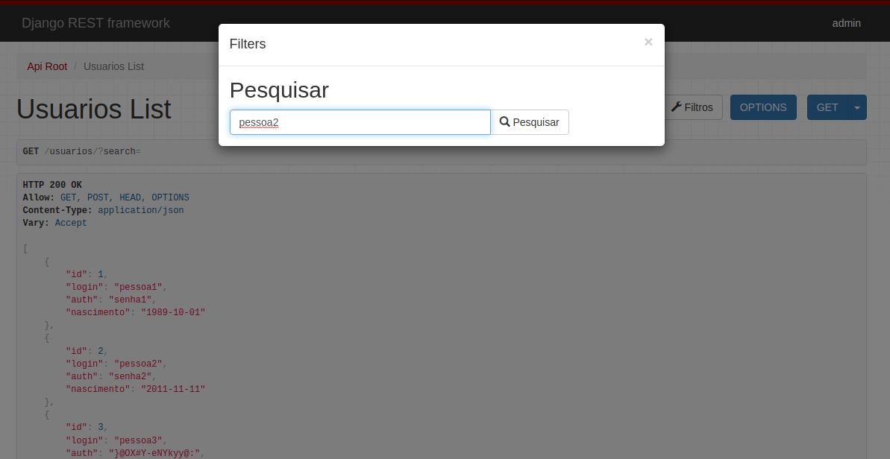

Opa, bão?

Neste projeto eu desenvolvi uma aplicação utilizando Django Rest Framework para realizar inserções de novos usuários em um banco de dados.
Nesta aplicação foi criada uma função que tem por objetivo gerar uma senha de 15 dígitos aleatórios, caso o usuário deixe o campo em branco.
Observação: django-admin (login: admin; senha: admin)

Em seguida foi adicionada a funcionalidade de pesquisa, que permite procurar um cadastro por 'id' ou por 'nome'.
Além disso foram aplicados "renderers" para possibilitar a manipulação dos dados em xlsx e csv.

Por fim, uma pequena página de front end foi feita, ilustrando como poderia ser implementada a aplicação desenvolvida. 

Abaixo estão algumas imagens da aplicação rodando, pra facilitar a vida do recrutador: 

